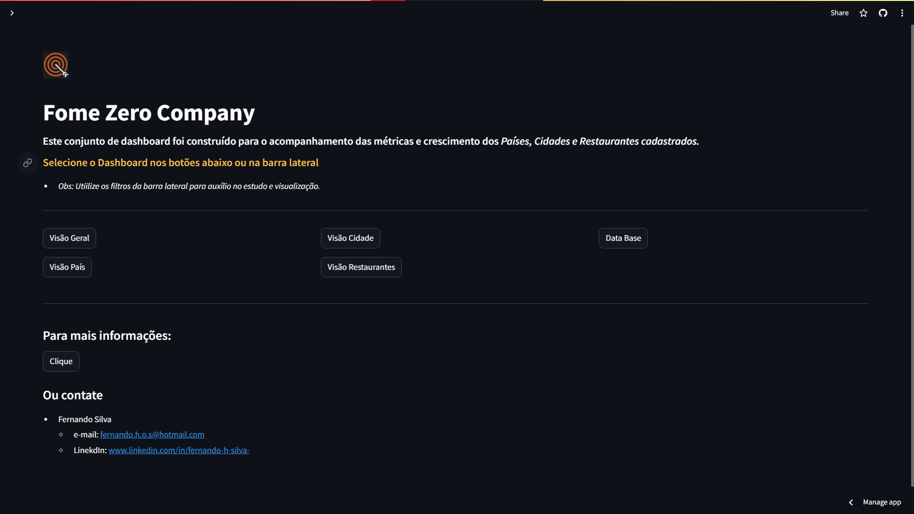
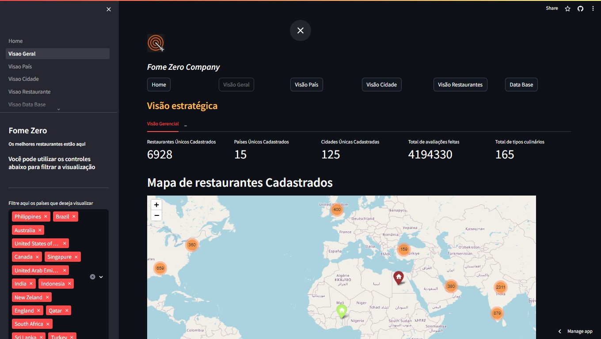
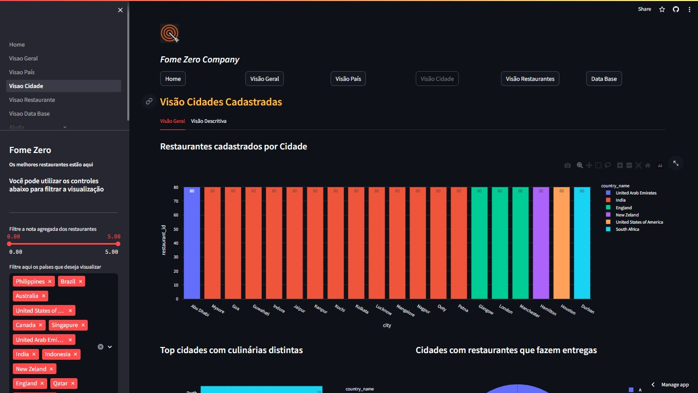
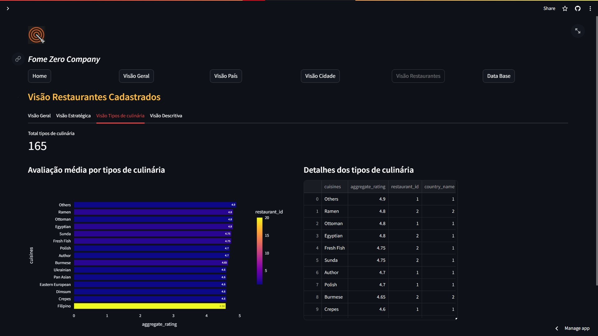

# Fome Zero

- Para visualizar o produto final do projeto acesse a página web: https://dashboards-projects-fnord-fome-zero.streamlit.app/

## 1. Problema de Negócio
A empresa Fome Zero é uma marketplace de restaurantes. Ou seja, seu core business é facilitar o encontro e negociações de clientes e restaurantes. Os restaurantes fazem o cadastro dentro da plataforma da Fome Zero, que disponibiliza informações como endereço, tipo de culinária servida, se possui reservas, se faz entregas e também uma nota de avaliação dos serviços e produtos do restaurante, dentre outras informações.

A Fome Zero acaba de contratar um novo CEO, o senhor Kleiton Guerra, que deseja que você, recém contratado como cientista de dados o ajude a identificar pontos chaves da empresa, respondendo às perguntas que ele fizer utilizando dados. Estes pontos chaves deverão ser apresentados em forma de KPIs estratégicos que proporcionem a tomada de decisões simples, mas não menores importantes.

O CEO gostaria de ver as seguintes métricas de crescimento: A Cury Company é uma empresa de tecnologia que criou um aplicativo que conecta clientes a restaurantes. Através desse aplicativo, é possível analisar em qual restaurantes realizar pedido de uma refeição, em qualquer restaurante cadastrado, fornecendo dados como localização, preço médio do prato para duas pessoas, tipo de culinária, se aceita reserva, se faz entregas, etc.

O Kleiton Guerra ainda não tem visibilidade completa dos KPIs de crescimento da empresa. Você foi contratado como um Cientista de Dados para criar soluções de dados para entrega, mas antes de treinar algoritmos, a necessidade da empresa é ter um os principais KPIs estratégicos organizados em uma única ferramenta, para que o CEO possa consultar e conseguir tomar decisões simples, porém importantes. A Fome Zero possui um modelo de negócio chamado Marketplace, que faz o intermédio do negócio entre dois clientes: compradores de comida e restaurantes. Para acompanhar o crescimento desses negócios, o CEO gostaria de ver as seguintes métricas de crescimento:

### 1.1 Visão Países:
Métricas gerais: Restaurantes, Países, Cidades, Avaliações e Culinária registrada na base de dados.
País com maior quantidade de Cidades, Restaurante, Preço de prato para dois, Culinárias distintas e Avaliações registradas.
Distribuição dos restaurantes registrados por país.
Distribuição de cidades registradas por país.
Distribuição das médias de avaliações por país.
Distribuição da média de preço para dois por país.
Localização de todos os restaurantes registrados com a informação do nome do restaurante, do tipo de culinária, preço médio para dois, avaliação média e a coloração do localizador de acordo com a média do estabelecimento.

### 1.2 Visão Cidades:
Métricas gerais: Cidade que possui mais restaurantes com reservas, que mais fazem entregas e que mais faz pedidos online.
Cidade com maior quantidade de restaurantes registrados.
Distribuição de cidades com restaurantes com avaliações maiores ou igual a 4.
Distribuição de cidades com restaurantes com avaliações menores ou igual a 2,5.
Distribuição de restaurantes com maior número de culinária distinta.

### 1.3 Visão Culinária:
Métricas gerais: Culinárias melhor avaliadas por tipo de culinária.
Distribuição de Países contendo cidade, culinária, restaurante, média de avaliação média agregada, média de preço de prato para 2 e média de votos registrados.
Distribuição de melhor e pior culinária avaliada.
Distribuição países em Maior quantidade de Restaurantes que Fazem Entrega e aceitam Pedidos Online por tipo de culinária.
O objetivo desse projeto é criar um conjunto de gráficos e/ou tabelas que exibem essas métricas da melhor forma possível para o CEO.

## 2. Estratégia da Solução
- Construir um relatório com as princípais visões de negócio (segmentações das análises): Visão por Países, Visão por Cidades, Visão por Culinária.
- Como informado no problema de negócio, o modelo de negócio é markeplace.
- Foi decidido criar uma página no streamlit no formato de app, para armazenar as análises gráficas solicitadas.

### 2.1 Visão Geral:
Foi criada uma página de visão geral contendo métricas gerais descritivas do cadastro de restaurantes da empresa como:
- Núrmero de restaurantes registrados;
-  Países cadastrados;
-  Cidades cadastradas;
- Total de avaliações feitas;
- Total de tipos de culinária cadastrados;
- Visualização de mapa com todos os restaurantes cadastrados;

### 2.2 Visão do agrupamento por Países:

#### Visão geral
- Top 10 países com mais restaurantes cadastrados;
- Top 10 países com mais cidades cadastradas;
- Países com restaurantes Gourmet;

#### Visão Estratégica
- Preço média de prato para dois por País;
- Média da quantidade de avaliações feitas por País;
- Nota média de avaliações por País.

#### Visão descritiva
- Tabela contendo informações gerais de cada País.

### 2.3 Visão Cidade:

#### Visão Geral
- Restaurantes cadastrados por Cidade;
- Top cidades com culinárias distintas;
- Cidades com restaurantes que fazem entregas;
- Top 7 Cidades com maior média de avaliação.

#### Visão Descritiva
- Top 3 cidades com maior avaliação;
- Top 3 cidades com menor avaliação;
- Tabela contendo informações gerais de cada Cidade.

### 2.4 Visão Restaurante:

#### Visão geral
- Total de restaurantes cadastrados;
- Restaurantes que fazem reserva;
- Restaurantes que fazem entrega;
- Culinárias distintas por Países.

#### Visão Estratégica
- Top 3 restaurantes com maior avaliação média;
- Top 3 com menor avaliação média;
- Restaurantes cadastrados por Cidade;
- Custo Prato para duas pessos por Restaurante.

#### Visão Tipos de Culinária
- Total tipos de culinária;
- Avaliação média por tipos de culinária;
- Detalhes dos tipos de culinária.

#### Visão descritiva
- Informações dos retaurantes cadastrados.

### 2.5 Algumas Imagens do relatório
| Visão Geral   | Visão Países |
| ------------- | ------------- |
|  |   |
| **Visao Cidades**  | **Visão Restaurantes**  |
|  |  

## 3. Tecnologias usadas
- **Python:**
  - **Pandas:** Extração, tratamento dos dados, construções de análises.
  - **Numpy:** Contrução das análises gráficas.
  - **Folium:** Construção de visualização de mapa.
  - **Streamlit:** Desenvolvimento da página web, barra lateral, textos, inserção de gráficos, botões de movimentação de página.

## 4. Como executar o projeto
- Para executar o projeto localmente faça o dowlonad das pastas "pages" e "datasets/comunidade_ds" e o arquivo "Home.py". Tendo todas as bibliotecas instaladas na sua interface de desenvolvimento, execute o arquivo Home.py no terminal.
- Utilize os filtros e gráfico interativos para visualização das métricas.
- Em caso de dúvidas, veja a página de "Ajuda" do site web

## 5. Top 3 Insights de dados
- A Índia é o páis que possue mais restaurantes, cidades e tipos de culinária cadastrados, sendo o segundo colocado em quantidade média de avaliações;
- A média de avaliações não acompanha a quantidade de restaurantes registrados.
  - Exemplo: Apesar da Índia se ro segundo colocado em quantidade média de avaliações, ela está em décimo terceiro lugar dos páises com maios nota média de avaliações médias;
  - Sugestão: Realizar uma **análise diganóstica** para validar o porque de a Índia possuir uma nota média de avaliações média inferior aos demais países, sendo o segundo colocado em quantidade média de avaliações, valdiando os retaurantes cadastrados e análisando quais fazem sentido de manter cadastrados.
  
- As 20 cidades que mais possuem restaurantes cadastrados possuem equivalentes 80 restaurantes cadastrados;
  - Sugestão: Após análise da base de dados recebida foi confirmado que não há erro no tratamento dos dados, fazendo sentido validar se a base de restaurantes cadastrados está correta, em caso afirmativo, verificar o porque as top cidades com restaurantes cadastros permanecem com 80 restaurantes todas elas (talvez alguma regra do negócio?).

### 5.1 Outros Insights
- A culinária "North Indian" é a que possue mais restaurantes cadastrados;
- Os Estados Unidos é o país que mais possui restaurantes gourmet, represetando aproximadamente 30% dos restaurantes registrados;
- Singapura é o país com maior média de preço de prato para duas pessoas e também o país que possui a maior nota média nas avaliações.

## 6. Próximos Passos
1. Automatização do dashboard após novo recebimento de dados.
2. Criar novos filtros e visualizações após novo feedback
2. Realizar uma análise diagnóstica para estudo dos insights sugeridos no item 5 e outras solicitações da equipe de RH.

## 7. Conteúdos relacionados ao projeto
- **Apresentação do proejto e navegação da página:** https://www.linkedin.com/posts/fernando-h-silva-_anaerlisededados-python-pandas-activity-7226586729661513729-uDIp?utm_source=share&utm_medium=member_desktop
- **Conteúdo sobre Jornada de Usuário utilizando o projeto:** https://www.linkedin.com/posts/fernando-h-silva-_python-streanlit-stramlit-activity-7227335257543376896-gv8h?utm_source=share&utm_medium=member_desktop
